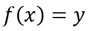
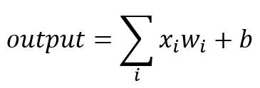

## Road to EVA...

### What are Kernels and Channels ?

#### Channels

Each Channel is a container of specific information, so make it more clear, lets take an example of Television:

Here each channel that you see in an image broadcasts shows of specific information. You can never expect news in Cartoon Network or expect Anime's/Cartoons in CNN. 
Therefore in DNN, these represents a containers which contains a features maps. 

#### Kernel

Kernel is the guy which extracts the features for us. Kernel can be called as filter or features extractor as well. Its task is to take the input and extract features out of it and store them in feature maps called as channels.

---

### Why should we (nearly) always use 3x3 kernels ?

While convoluting an image, we always nearly use **odd sized kernels or filters, because when we convolve on pixel level we will have symmetry around the center pixel** when we use odd sized kernels. But, if we use even sized kernels. We will lose that symmetry which can cause distortions, so mostly we don't use even sized kernels.

Now we have clear understanding about why we prefer odd sized kernels, but why 3x3 mainly. In odd sized kernels, we use 1x1 when we want to decrease the channels or any bottleneck situations. Other than that we use 3x3 mainly because compared to 5x5, 7x7 and etc... 3x3 have less parameters and most compilers are optimized for 3x3 kernels. Receptive Filed of 1 5x5 kernel is equal to 2 3x3 kernel, so in place of 5x5 we can do 2 3x3 operations and save some parameters too... as you can see 1 5x5 kernel have 25 parameters, but 2 3x3 have (9 * 2) = 18 parameters. Same applies for all higher odd number kernels, 1 7x7 equals to 3 3x3 kernels. 

---

### How many times to we need to perform 3x3 convolutions operations to reach close to 1x1 from 199x199 ?

If the **input considered is 199x199**, we need to do **99 3x3 convolutions to get to 1x1** as shown below:

**199x199** > 197x197 > 195x195 > 193x193 > 191x191 > 

189x189 > 187x187 > 185x185 > 183x183 > 181x181 > 

179x179 > 177x177 > 175x175 > 173x173 > 171x171 > 

169x169 > 167x167 > 165x165 > 163x163 > 161x161 > 

159x159 > 157x157 > 155x155 > 153x153 > 151x151 > 

149x149 > 147x147 > 145x145 > 143x143 > 141x141 > 

139x139 > 137x137 > 135x135 > 133x133 > 131x131 > 

129x129 > 127x127 > 125x125 > 123x123 > 121x121 > 

119x119 > 117x117 > 115x115 > 113x113 > 111x111 > 

109x109 > 107x107 > 105x105 > 103x103 > 101x101 > 

99x99 > 97x97 > 95x95 > 93x93 > 91x91 > 

89x89 > 87x87 > 85x85 > 83x83 > 81x81 > 

79x79 > 77x77 > 75x75 > 73x73 > 71x71 > 

69x69 > 67x67 > 65x65 > 63x63 > 61x61 > 

59x59 > 57x57 > 55x55 > 53x53 > 51x51 > 

49x49 > 47x47 > 45x45 > 43x43 > 41x41 > 

39x39 > 37x37 > 35x35 > 33x33 > 31x31 > 

29x29 > 27x27 > 25x25 > 23x23 > 21x21 > 

19x19 > 17x17 > 15x15 > 13x13 > 11x11 > 

9x9 > 7x7 > 5x5 > 3x3 > **1x1**

---

### How are kernels initialised? 

Initialisation of Neural Networks Kernel are always to small random numbers close to zero, which in turn helps in training the model and leads to gradient decent.

Using this random nature we try to find a good connection between the inputs and the outputs. This help us in fitting different networks on same data whenever we train afresh.

There is no doubt that training gets affected by the kernel initialisation. As every story need a starting point, here as well we need some initial point where we can start our iterations. We avoid initialising is to zeroes as it may lead to training fail as the weights wont change and the model will get stuck.

Therefore pinpointing a strategy to initialise the weights of a neural network is waste as there is none and we will take this as a HYPER-PARAMETER.

---

### What happens during the training of a DNN ?

The primary task of a DNN is to map an input *x* to an output *y*. So essentially, a DNN can be thought of as a function *f* where,

At the heart of any DNN, lies the neuron, which computes the weighted sum of its input and adds a bias term to it, to produce the final output.

Mathematically,

where *xi* are the inputs, *wi* is the weight (the 'importance' of an input, so to speak.) of each input, and *b* is the bias term.

Now, this equation can be rewritten as:

where, *w* and *x* are vectors containing the weights of the inputs and the inputs respectively.

The values of the weights *w* and bias *b* should be such that the mapping *f* should hold true for input *x*. Finding these values is what training a DNN is about.

---

