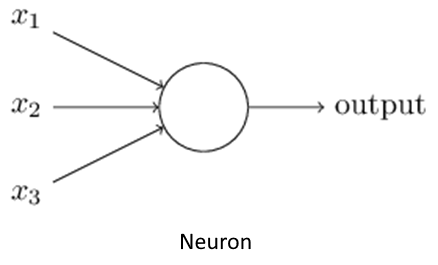
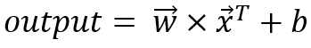

# What happens during the training of a DNN

The primary task of a DNN is to map an input *x* to an output *y*. So essentially, a DNN can be thought of as a function *f* where,

At the heart of any DNN, lies the neuron, which computes the weighted sum of its input and adds a bias term to it, to produce the final output.

Mathematically,

where *xi* are the inputs, *wi* is the weight (the 'importance' of an input, so to speak.) of each input, and *b* is the bias term.

Now, this equation can be rewritten as:

where, *w* and *x* are vectors containing the weights of the inputs and the inputs respectively.

The values of the weights *w* and bias *b* should be such that the mapping *f* should hold true for input *x*. Finding these values is what training a DNN is about.
