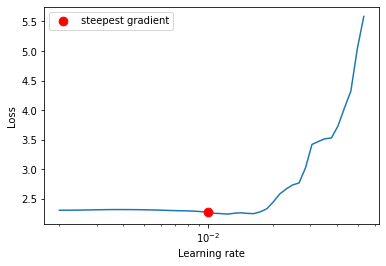
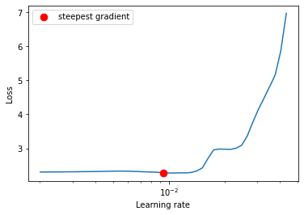
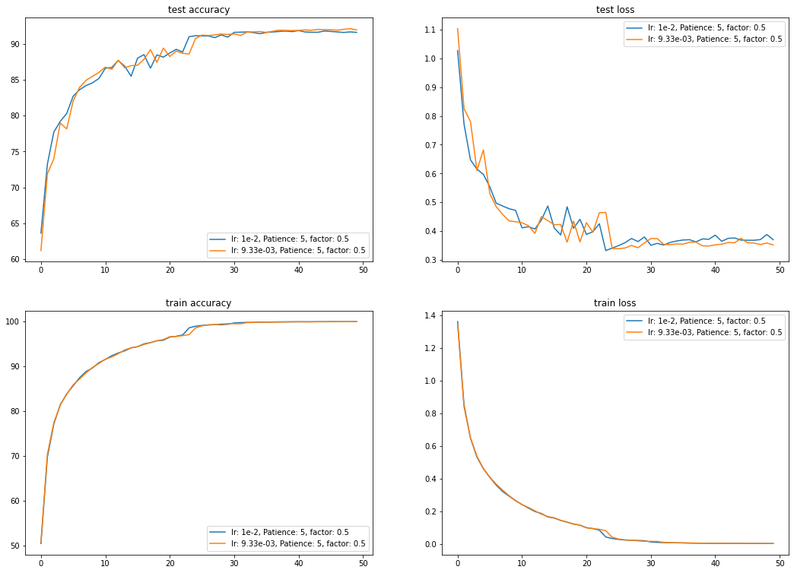
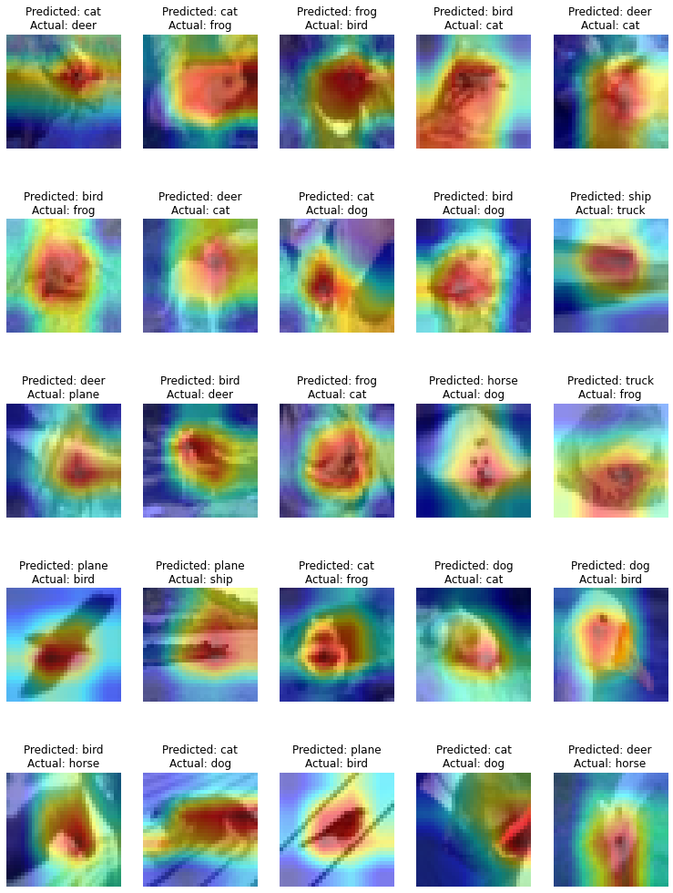
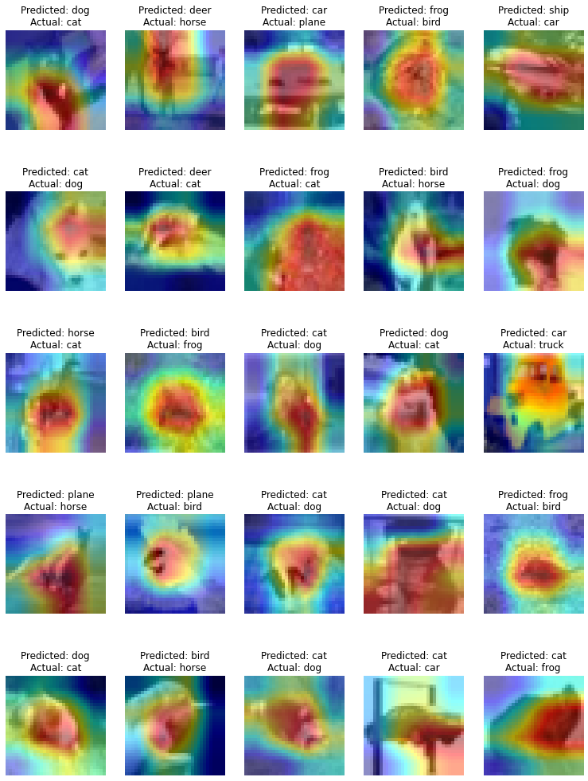

# Assignment 10

In this assignment, we had to get ResNet-18 trained up to an accuracy of at least 88%. Unlike the last assignment, this time there is a constraint on the number of epochs. The required accuracy had to be reached by epoch 50. In addition, we had to use the LR Finder to first find an optimal learning rate to start training with, and apply gradcam to 25 misclassified images.

## Package used
The athena package was improved on (again, 🤦‍♂️) and used in this assignment. [Link to the package documentation](https://firekind.github.io/athena).

## LR Finder
The LR Finder was used to first find an optimal learning rate to start training with. The LR finder was run twice. For the first run, the optimal learning rate found was `1e-2` as seen below:



The second run of the LR finder yielded a learning rate of `9.33e-3` as seen below:



The train dataset was used to find the learning rate, and the test dataset was used as a validation set to make the results more robust to noise. This is seen from the fact that the two proposed learning rates have a difference of about `0.0067`. The step mode was set to exponential while applying the LR finder. 

## Training
Using the two learning rates, two experiments were run. Both experiments used:
1. Cross entropy loss function (figured out it was a combination of log softmax and nll loss)
2. SGD optimizer with momentum `0.9`
3. `ReduceLROnPlateau` for learning rate scheduler, with a `patience` of `5` and `factor` of `0.5`.
4. Random crop of 32x32 (after applying padding to get it to a size of 36x36) followed by random horizontal flip and normalization for data augmentation techniques.

The only difference is that the first experiment used `1e-2` for the initial learning rate and the second experiment used `9.33e-3` for the initial learning rate.

Here's the link to the notebook (in github) that was used to train: [link](./assignment.ipynb)

## Results
The highest accuracy was 91.86% (epoch 41) in the first experiment (with initial lr as `1e-2`) and for the second experiment (with initial lr as `9.33e-3`) the highest accuracy reached was 92.13% (epoch 49).

The target accuracy was reached at epoch 16 for the first experiment and at epoch 18 for the second experiment.

Here are the plots:



Here are some of the training logs:

Experiment 1 (initial lr: `1e-2`):

```
.
.
.
Epoch: 12 / 50
391/391 [==============================] - 64s 162ms/step - train loss: 0.2199 - train accuracy: 92.3700
Test set: Average loss: 0.4159, Accuracy: 8672/10000 (86.72%)

Epoch: 13 / 50
391/391 [==============================] - 64s 163ms/step - train loss: 0.1992 - train accuracy: 92.9760
Test set: Average loss: 0.4078, Accuracy: 8769/10000 (87.69%)

Epoch: 14 / 50
391/391 [==============================] - 64s 163ms/step - train loss: 0.1873 - train accuracy: 93.4440
Test set: Average loss: 0.4386, Accuracy: 8690/10000 (86.90%)

Epoch: 15 / 50
391/391 [==============================] - 64s 163ms/step - train loss: 0.1658 - train accuracy: 94.1180
Test set: Average loss: 0.4877, Accuracy: 8550/10000 (85.50%)

Epoch: 16 / 50
391/391 [==============================] - 64s 163ms/step - train loss: 0.1590 - train accuracy: 94.3760
Test set: Average loss: 0.4114, Accuracy: 8802/10000 (88.02%)
.
.
.
Epoch: 41 / 50
391/391 [==============================] - 64s 163ms/step - train loss: 0.0041 - train accuracy: 99.9280
Test set: Average loss: 0.3865, Accuracy: 9186/10000 (91.86%)
.
.
.

```

Experiment 2:

```
Epoch: 14 / 50
391/391 [==============================] - 64s 163ms/step - train loss: 0.1833 - train accuracy: 93.6420
Test set: Average loss: 0.4510, Accuracy: 8668/10000 (86.68%)

Epoch: 15 / 50
391/391 [==============================] - 63s 162ms/step - train loss: 0.1681 - train accuracy: 94.1460
Test set: Average loss: 0.4371, Accuracy: 8697/10000 (86.97%)

Epoch: 16 / 50
391/391 [==============================] - 64s 163ms/step - train loss: 0.1608 - train accuracy: 94.3620
Test set: Average loss: 0.4229, Accuracy: 8703/10000 (87.03%)

Epoch: 17 / 50
391/391 [==============================] - 64s 163ms/step - train loss: 0.1455 - train accuracy: 94.8740
Test set: Average loss: 0.4234, Accuracy: 8787/10000 (87.87%)

Epoch: 18 / 50
391/391 [==============================] - 64s 163ms/step - train loss: 0.1339 - train accuracy: 95.2740
Test set: Average loss: 0.3623, Accuracy: 8921/10000 (89.21%)
.
.
.
Epoch: 49 / 50
391/391 [==============================] - 64s 163ms/step - train loss: 0.0032 - train accuracy: 99.9440
Test set: Average loss: 0.3591, Accuracy: 9213/10000 (92.13%)
.
.
.
```

## GradCAM++ on misclassified images

GradCAM++ was applied on 25 misclassified images of the two experiments.

For the first experiment:



And for the second experiment



## Lessons Learned

1. LR Finder is pretty useful. Having a good initial learning rate and a decent set of data augmentation techniques can improve training time by drastic amount.

2. GradCAM (or GradCAM++) is very useful in figuring out why the model messed up its predictions. For example, we can see that model thinks that anything with a wingspan is a plane, and it mistook the snout of a horse to be a beak of a bird.
