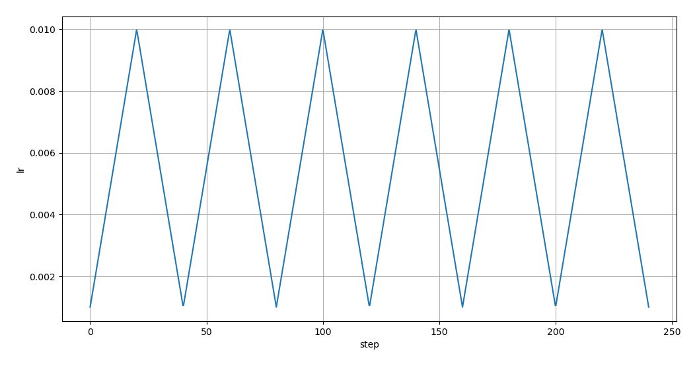
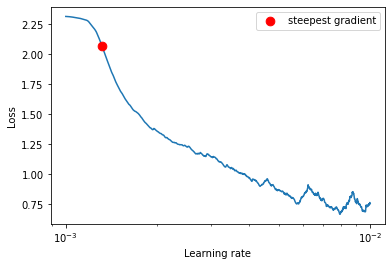
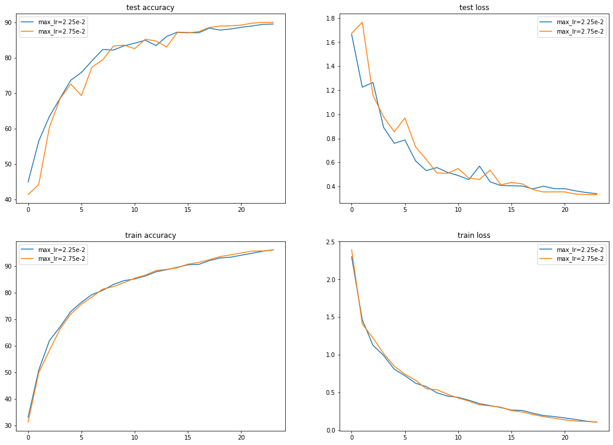
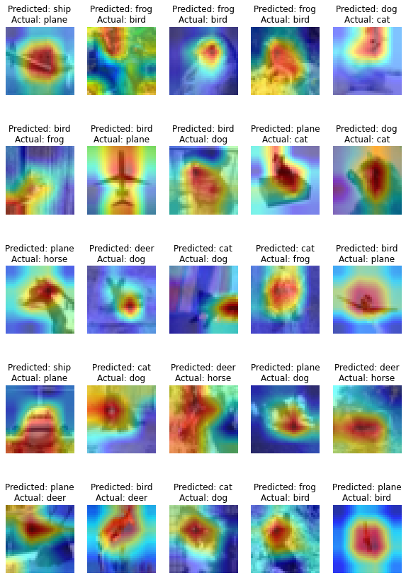

# Assignment 11

In this assignment we had to train a network (similar to [DavidNet](https://github.com/davidcpage/cifar10-fast/tree/d31ad8d393dd75147b65f261dbf78670a97e48a8)) to upto 90% accuracy in 24 epochs, using one cycle lr policy. and also, we had to plot a triangular wave using matplotlib.

## The triangle wave plot
[This](./triangle-wave-plot.py) is the code that generated the plot and the plot itself:



## Package used

The athena package was improved on (again, 🤦‍♂️) and used in this assignment. [Link to the package documentation](https://firekind.github.io/athena).
link to the david net model implemented in this assignment: [link](https://github.com/firekind/athena/blob/98cc8c6b0cccf653a4a980cfdac73bc229836072/athena/models/davidnet.py)

## LR Finder
The LR Finder was used to first find an optimal learning rate to start training with. The results of the lr finder is:



## Training
A bunch of experiments (around 5 or so) were run to find the best learning rate to achieve 90% accuracy. For more details, please look into the explanations and summaries in the notebook.

Here's the link to the notebook (in github) that was used to train: [link](./assignment.ipynb)

## Results
The highest accuracy reached was 90.05% with a learning rate of `2.75e-2`.
Here are the plots:



Here are some of the training logs:

Experiment 1 (max lr: `2.75e-2`):

```
=> Running experiment: max_lr=2.75e-2
Epoch: 1 / 24
98/98 [==============================] - 16s 166ms/step - train loss: 2.3926 - train accuracy: 31.2660
Test set: Average loss: 1.6742, Accuracy: 4142/10000 (41.42%)

Epoch: 2 / 24
98/98 [==============================] - 16s 166ms/step - train loss: 1.4093 - train accuracy: 49.8920
Test set: Average loss: 1.7656, Accuracy: 4426/10000 (44.26%)

Epoch: 3 / 24
98/98 [==============================] - 16s 166ms/step - train loss: 1.2250 - train accuracy: 58.2920
Test set: Average loss: 1.1585, Accuracy: 6047/10000 (60.47%)

Epoch: 4 / 24
98/98 [==============================] - 16s 167ms/step - train loss: 1.0189 - train accuracy: 66.3720
Test set: Average loss: 0.9792, Accuracy: 6847/10000 (68.47%)

Epoch: 5 / 24
98/98 [==============================] - 16s 167ms/step - train loss: 0.8506 - train accuracy: 71.9960
Test set: Average loss: 0.8556, Accuracy: 7261/10000 (72.61%)

Epoch: 6 / 24
98/98 [==============================] - 16s 167ms/step - train loss: 0.7459 - train accuracy: 75.7400
Test set: Average loss: 0.9702, Accuracy: 6937/10000 (69.37%)

Epoch: 7 / 24
98/98 [==============================] - 16s 166ms/step - train loss: 0.6643 - train accuracy: 78.4860
Test set: Average loss: 0.7296, Accuracy: 7741/10000 (77.41%)
.
.
.
Epoch: 24 / 24
98/98 [==============================] - 16s 166ms/step - train loss: 0.1122 - train accuracy: 96.1720
Test set: Average loss: 0.3332, Accuracy: 9005/10000 (90.05%)

```

## GradCAM++ on misclassified images

GradCAM++ was applied on 25 misclassified images of the two experiments.




## Lessons Learned

1. LR Finder + OneCycle policy is a very good technique to find out the ability of the model.
