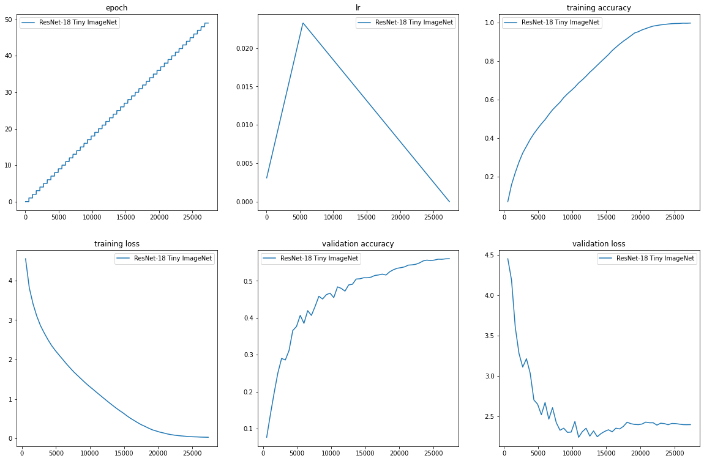

# Assignment 12
In this assignment we had to:
- Train ResNet-18 on tiny imagenet and get up to 50% accuracy in 50 epochs
- Construct a dataset containing images of hardhats, masks, vests and boots, and find the optimal number of clusters.

## ResNet-18 on Tiny ImageNet
The jupyter notebook that was used to train the model: [link](./tinyimagenet.ipynb).  The package used: [athena](https://firekind.github.io/athena).

### Results
The max accuracy that was reached was 56.01%. Here are the plots:

## Custom dataset
Have a look at the [jupyter notebook](./exploring-dataset.ipynb).