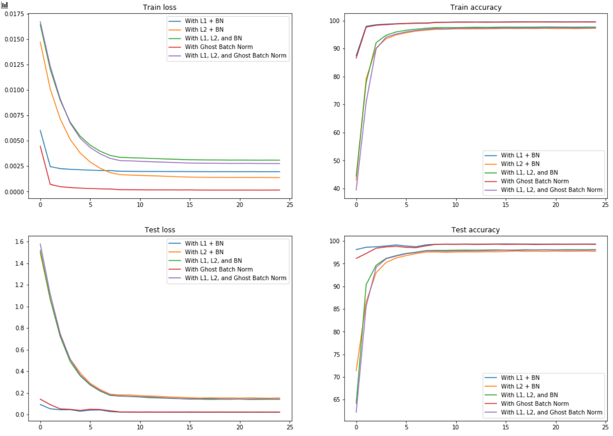

# Batch Normalization and Regularization Assignment

In this assignment, we had to take the best model from the previous assignment and run 5 experiments on it. These experiments were about trying out L1 and L2 loss, as well as ghost batch normalization technique.

## Experiment 1
This experiment involved testing the model with L1 loss and good old batch normalization. 
- optimizer: SGD with `lr`=0.01, `momentum`=0.9
- scheduler: StepLR with `step size`=8 and `gamma`=0.1
- `l1 lambda`=5e-4

The test and train loss quickly reduces when L1 regularization is applied. moreover, the train and test accuracy of the model quickly rises when compared to L2 regularization

## Experiment 2
This experiment involved testing the model with L2 regularization and batch normalization
- optimizer: Adam with `lr`=1e-4 and `weight decay`=1e-5
- scheduler: StepLP with `step size`=8 and `gamma`=0.1
- loss function: negative log likely hood

The test and train loss doesn't seem to reduce as quickly as with L1 regularization, and the accuracy doesn't rise up that quickly, but it looks like the effect of regularization is a lot more prominent in L2 regularization, with the difference between train and test accuracy in the later epochs being around ~0.6, with the model leaning towards underfitting, which is good in some ways.

## Experiment 3
This experiment involved testing the model with both L1 and L2 regularization, and batch normalization.
- optimizer: Adam with `lr`=1e-4 and `weight decay`=1e-5
- scheduler: StepLP with `step size`=8 and `gamma`=0.1
- `l1 lambda`=5e-4

This experiment's results looks similar to that of experiment 2, with L2 regularization's effect being more prominent than L1. This could be fixed by increasing `l1 lambda` to give more weightage to L1 regularization, but for the purposes of a fair comparison, the `l1 lambda` value is kept constant throughout all the experiments.

## Experiment 4
This experiment involved testing the model with only ghost batch normalization
- optimizer: SGD with `lr`=0.01, `momentum`=0.9
- scheduler: StepLP with `step size`=8 and `gamma`=0.1
- number of splits: 2

Ghost batch normalization vastly out performs both L1 regularization and L2 regularization. Not only does the model train quickly, the accuracy achieved is much higher than any of the other experiments. Ghost batch normalization FTW! :raised_hands:

## Experiment 5
This experiment involved testing the model with both L1 and L2 regularization, along with Ghost Batch Normalization.
- optimizer: Adam with `lr`=1e-4 and `weight decay`=1e-5
- scheduler: StepLP with `step size`=8 and `gamma`=0.1
- `l1 lambda`=5e-4

Performance falls drastically when compared to experiment 4. This experiment performs just a bit better than experiment 3. Looks like choosing a good hyperparameter value for the L1 regularization weight is important. Also, it looks like too many cooks spoil the broth.

## Plots and Images
Here's the plot for the loss and accuracies for train and test phases:

And here's 25 misclassified images from experiment 4:

## Appendix
The code has couple of classes:
- The classes related to the model (`Net` and `GhostBatchNorm`),
- A `Solver` class
- An `Experiment` class
- A `History` class
- and couple of helper functions (to plot the graph and misclassified images)

Each `Experiment` consists of a name, model and a `Solver`. The `Solver` consists of the code that directly acts on the model, i.e., the training, testing loops and a helper function to get misclassified images. The `Experiment`'s `run` method executes the training procedure, the `Solver.train` method. The train and test losses and accuracies are recorded while training, and are returned to the `Experiment` as a `History` object once training is completed. This `History` object is then used to plot the graphs, and the `Solver.get_misclassified` function is used to get the data of the images the model misclassifies.
