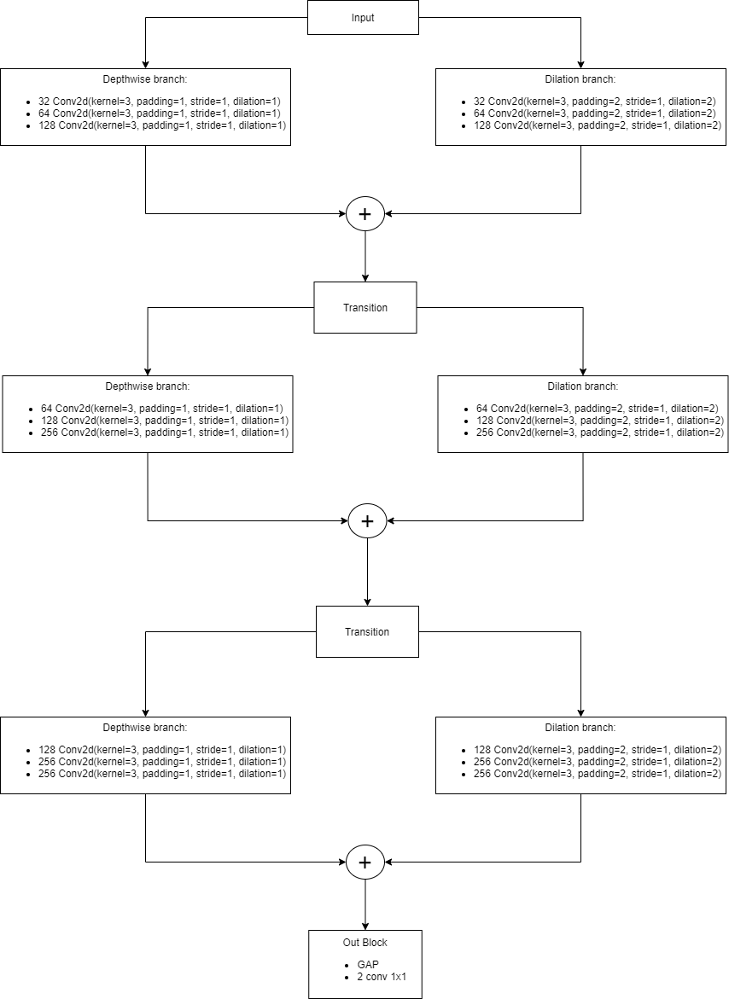
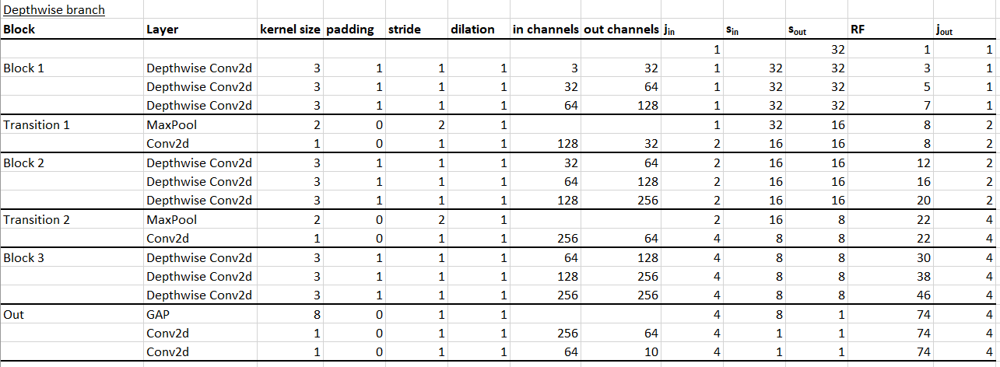
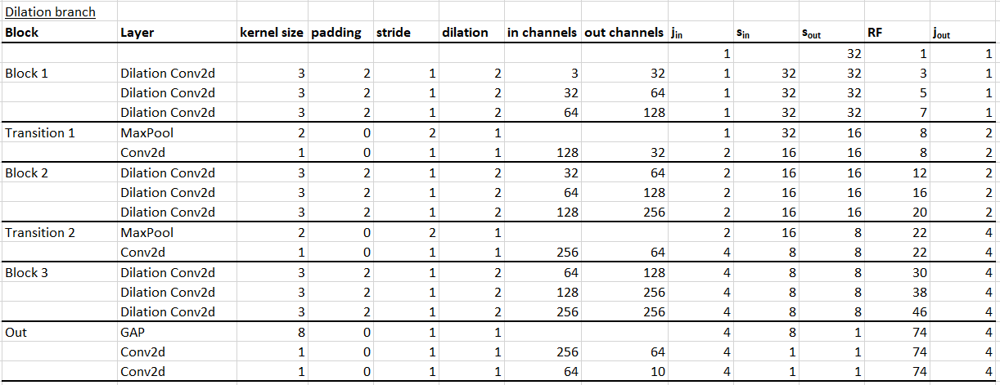

# Assignment 7

In this assignment, we had to create a model that will be trained on the cifar 10 dataset. The constraints in this assignment were:

1. Atleast one depthwise convolution should be used.
2. Atleast one dilated convolution should be used.
3. Parameter count should be less than one million.
4. Number of epochs can be anything.

## Package used
The athena package was developed and used in this assignment. [Link to the package documentation](https://firekind.github.io/athena).

## Model architecture

The model follows a group convolution architecture, with one branch containing depthwise convolutions and the other containing dilated convolutions. Three such blocks are present in the architecture, separated by a MaxPool and a 1x1 conv. The output block contains a GAP and 2 1x1 convolutions. Dropout layers with a 0.25 dropout value and batch normalization were used in the blocks. [Link to the source code](https://github.com/firekind/athena/blob/master/athena/models/cifar10_v1.py).

The architecture is as follows:



Summary of the model:

```
----------------------------------------------------------------
        Layer (type)               Output Shape         Param #
================================================================
            Conv2d-1            [-1, 3, 32, 32]              30
            Conv2d-2           [-1, 32, 32, 32]             128
   DepthwiseConv2d-3           [-1, 32, 32, 32]               0
       BatchNorm2d-4           [-1, 32, 32, 32]              64
              ReLU-5           [-1, 32, 32, 32]               0
           Dropout-6           [-1, 32, 32, 32]               0
            Conv2d-7           [-1, 32, 32, 32]             320
            Conv2d-8           [-1, 64, 32, 32]           2,112
   DepthwiseConv2d-9           [-1, 64, 32, 32]               0
      BatchNorm2d-10           [-1, 64, 32, 32]             128
             ReLU-11           [-1, 64, 32, 32]               0
          Dropout-12           [-1, 64, 32, 32]               0
           Conv2d-13           [-1, 64, 32, 32]             640
           Conv2d-14          [-1, 128, 32, 32]           8,320
  DepthwiseConv2d-15          [-1, 128, 32, 32]               0
      BatchNorm2d-16          [-1, 128, 32, 32]             256
             ReLU-17          [-1, 128, 32, 32]               0
          Dropout-18          [-1, 128, 32, 32]               0
           Conv2d-19            [-1, 3, 32, 32]              30
           Conv2d-20           [-1, 32, 32, 32]             128
  DepthwiseConv2d-21           [-1, 32, 32, 32]               0
      BatchNorm2d-22           [-1, 32, 32, 32]              64
             ReLU-23           [-1, 32, 32, 32]               0
          Dropout-24           [-1, 32, 32, 32]               0
           Conv2d-25           [-1, 32, 32, 32]             320
           Conv2d-26           [-1, 64, 32, 32]           2,112
  DepthwiseConv2d-27           [-1, 64, 32, 32]               0
      BatchNorm2d-28           [-1, 64, 32, 32]             128
             ReLU-29           [-1, 64, 32, 32]               0
          Dropout-30           [-1, 64, 32, 32]               0
           Conv2d-31           [-1, 64, 32, 32]             640
           Conv2d-32          [-1, 128, 32, 32]           8,320
  DepthwiseConv2d-33          [-1, 128, 32, 32]               0
      BatchNorm2d-34          [-1, 128, 32, 32]             256
             ReLU-35          [-1, 128, 32, 32]               0
          Dropout-36          [-1, 128, 32, 32]               0
        MaxPool2d-37          [-1, 128, 16, 16]               0
           Conv2d-38           [-1, 32, 16, 16]           4,128
           Conv2d-39           [-1, 32, 16, 16]             320
           Conv2d-40           [-1, 64, 16, 16]           2,112
  DepthwiseConv2d-41           [-1, 64, 16, 16]               0
      BatchNorm2d-42           [-1, 64, 16, 16]             128
             ReLU-43           [-1, 64, 16, 16]               0
          Dropout-44           [-1, 64, 16, 16]               0
           Conv2d-45           [-1, 64, 16, 16]             640
           Conv2d-46          [-1, 128, 16, 16]           8,320
  DepthwiseConv2d-47          [-1, 128, 16, 16]               0
      BatchNorm2d-48          [-1, 128, 16, 16]             256
             ReLU-49          [-1, 128, 16, 16]               0
          Dropout-50          [-1, 128, 16, 16]               0
           Conv2d-51          [-1, 128, 16, 16]           1,280
           Conv2d-52          [-1, 256, 16, 16]          33,024
  DepthwiseConv2d-53          [-1, 256, 16, 16]               0
      BatchNorm2d-54          [-1, 256, 16, 16]             512
             ReLU-55          [-1, 256, 16, 16]               0
          Dropout-56          [-1, 256, 16, 16]               0
           Conv2d-57           [-1, 32, 16, 16]             320
           Conv2d-58           [-1, 64, 16, 16]           2,112
  DepthwiseConv2d-59           [-1, 64, 16, 16]               0
      BatchNorm2d-60           [-1, 64, 16, 16]             128
             ReLU-61           [-1, 64, 16, 16]               0
          Dropout-62           [-1, 64, 16, 16]               0
           Conv2d-63           [-1, 64, 16, 16]             640
           Conv2d-64          [-1, 128, 16, 16]           8,320
  DepthwiseConv2d-65          [-1, 128, 16, 16]               0
      BatchNorm2d-66          [-1, 128, 16, 16]             256
             ReLU-67          [-1, 128, 16, 16]               0
          Dropout-68          [-1, 128, 16, 16]               0
           Conv2d-69          [-1, 128, 16, 16]           1,280
           Conv2d-70          [-1, 256, 16, 16]          33,024
  DepthwiseConv2d-71          [-1, 256, 16, 16]               0
      BatchNorm2d-72          [-1, 256, 16, 16]             512
             ReLU-73          [-1, 256, 16, 16]               0
          Dropout-74          [-1, 256, 16, 16]               0
        MaxPool2d-75            [-1, 256, 8, 8]               0
           Conv2d-76             [-1, 64, 8, 8]          16,448
           Conv2d-77             [-1, 64, 8, 8]             640
           Conv2d-78            [-1, 128, 8, 8]           8,320
  DepthwiseConv2d-79            [-1, 128, 8, 8]               0
      BatchNorm2d-80            [-1, 128, 8, 8]             256
             ReLU-81            [-1, 128, 8, 8]               0
          Dropout-82            [-1, 128, 8, 8]               0
           Conv2d-83            [-1, 128, 8, 8]           1,280
           Conv2d-84            [-1, 256, 8, 8]          33,024
  DepthwiseConv2d-85            [-1, 256, 8, 8]               0
      BatchNorm2d-86            [-1, 256, 8, 8]             512
             ReLU-87            [-1, 256, 8, 8]               0
          Dropout-88            [-1, 256, 8, 8]               0
           Conv2d-89            [-1, 256, 8, 8]           2,560
           Conv2d-90            [-1, 256, 8, 8]          65,792
  DepthwiseConv2d-91            [-1, 256, 8, 8]               0
      BatchNorm2d-92            [-1, 256, 8, 8]             512
             ReLU-93            [-1, 256, 8, 8]               0
          Dropout-94            [-1, 256, 8, 8]               0
           Conv2d-95             [-1, 64, 8, 8]             640
           Conv2d-96            [-1, 128, 8, 8]           8,320
  DepthwiseConv2d-97            [-1, 128, 8, 8]               0
      BatchNorm2d-98            [-1, 128, 8, 8]             256
             ReLU-99            [-1, 128, 8, 8]               0
         Dropout-100            [-1, 128, 8, 8]               0
          Conv2d-101            [-1, 128, 8, 8]           1,280
          Conv2d-102            [-1, 256, 8, 8]          33,024
 DepthwiseConv2d-103            [-1, 256, 8, 8]               0
     BatchNorm2d-104            [-1, 256, 8, 8]             512
            ReLU-105            [-1, 256, 8, 8]               0
         Dropout-106            [-1, 256, 8, 8]               0
          Conv2d-107            [-1, 256, 8, 8]           2,560
          Conv2d-108            [-1, 256, 8, 8]          65,792
 DepthwiseConv2d-109            [-1, 256, 8, 8]               0
     BatchNorm2d-110            [-1, 256, 8, 8]             512
            ReLU-111            [-1, 256, 8, 8]               0
         Dropout-112            [-1, 256, 8, 8]               0
       AvgPool2d-113            [-1, 256, 1, 1]               0
          Conv2d-114             [-1, 64, 1, 1]          16,448
          Conv2d-115             [-1, 10, 1, 1]             650
================================================================
Total params: 380,646
Trainable params: 380,646
Non-trainable params: 0
----------------------------------------------------------------
Input size (MB): 0.01
Forward/backward pass size (MB): 32.71
Params size (MB): 1.45
Estimated Total Size (MB): 34.17
----------------------------------------------------------------
```

## Receptive field calculations
Here are some of the receptive field calculations:





## Training
The model was trained for 50 epochs, with an SGD optimizer with learning rate 0.008 and momentum 0.95. The highest accuracy was achieved at epoch 48, and it was around 83%. A snippet of the training output is shown below:

```
Epoch: 45 / 50
391/391 [==============================] - 38s 97ms/step - loss: 0.4089 - accuracy: 90.2380
Test set: Average loss: 0.5928, Accuracy: 8171/10000 (81.71%)

Epoch: 46 / 50
391/391 [==============================] - 38s 97ms/step - loss: 0.2184 - accuracy: 90.2660
Test set: Average loss: 0.5807, Accuracy: 8168/10000 (81.68%)

Epoch: 47 / 50
391/391 [==============================] - 38s 97ms/step - loss: 0.2928 - accuracy: 90.4080
Test set: Average loss: 0.6067, Accuracy: 8072/10000 (80.72%)

Epoch: 48 / 50
391/391 [==============================] - 38s 97ms/step - loss: 0.4077 - accuracy: 90.4120
Test set: Average loss: 0.5109, Accuracy: 8363/10000 (83.63%)

Epoch: 49 / 50
391/391 [==============================] - 38s 97ms/step - loss: 0.2714 - accuracy: 90.7680
Test set: Average loss: 0.6770, Accuracy: 7949/10000 (79.49%)

Epoch: 50 / 50
391/391 [==============================] - 38s 98ms/step - loss: 0.2823 - accuracy: 91.0240
Test set: Average loss: 0.6403, Accuracy: 8039/10000 (80.39%)
```

## Lessons learned:
1. Group convolutions are useful. In one way, they let the model learn and choose / combine between different branches that act on the data differently.
2. Model overfits too much. Need to look into ways to reduce the overfitting.
3. Writing your own package helps with experiment with different types of models quickly. Its a nice thing to have in your toolkit.
4. Depthwise convolution helps in reducing the parameter count by a huge margin.
5. Incorrect use of Dilated convolution can negatively impact accuracy of the model.