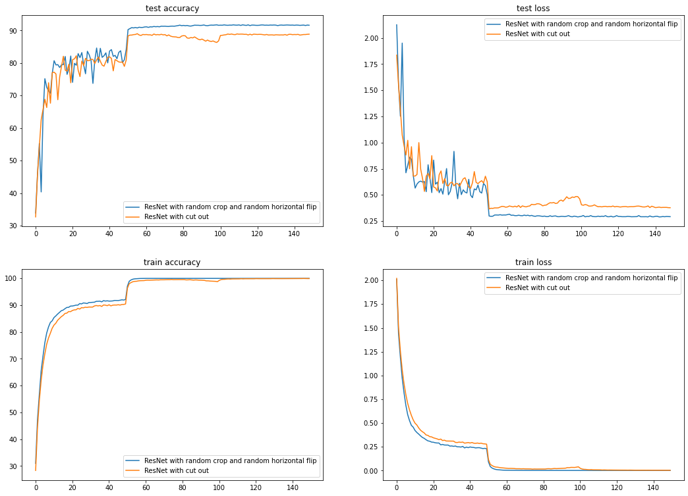
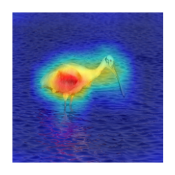

# Assignment 9

In this assignment, we had to get ResNet-18 trained up to an accuracy of at least 87%. Again, just like the last assignment, there were no constraints on the number of epochs. Also, we had to implement the Gradient-weighted Class Activation Mapping (GradCAM) algorithm and test it out using a pretrained vgg network.

## Package used
The athena package was improved on (a lot, again) and used in this assignment. [Link to the package documentation](https://firekind.github.io/athena).

## Training
Two experiments were run for training. One of the experiments used:
1. nll loss function
2. SGD optimizer with initial learning rate of `0.1`, momentum `0.9` and weight decay `5e-4` was used
3. `StepLR` as a learning rate scheduler, with step size as `50` (unlike the `100` used in the previous assignment) and gamma as `0.1`
4. number of epochs trained for was `150` (unlike the 115 in the previous assignment)
5. Random crop and random horizontal flip data augmentation techniques.

The other experiment was similar, it used:
1. nll loss function
2. SGD optimizer with initial learning rate of `0.1`, momentum `0.9` and weight decay `5e-4` was used
3. `StepLR` as a learning rate scheduler, with step size as `50` (unlike the `100` used in the previous assignment) and gamma as `0.1`
4. number of epochs trained for was `150` (unlike the 115 in the previous assignment)
5. Cutout augmentation techniques.

Here's the link to the notebook (in github) that was used to train: [link](./assignment.ipynb)

## Results
The highest accuracy was 91.75% (epoch 99) in the first experiment (with random crop and random horizontal flip as the data augmentation techniques) and for the second experiment (with cutout) the highest accuracy reached was 88.96% (epoch 111).

Here are the plots:



Here are some of the training logs:

Experiment 1:

```
Epoch: 47 / 150
391/391 [==============================] - 68s 174ms/step - train loss: 0.2365 - train accuracy: 91.8540
Test set: Average loss: 0.5180, Accuracy: 8378/10000 (83.78%)

Epoch: 48 / 150
391/391 [==============================] - 68s 174ms/step - train loss: 0.2320 - train accuracy: 92.0120
Test set: Average loss: 0.6095, Accuracy: 8011/10000 (80.11%)

Epoch: 49 / 150
391/391 [==============================] - 68s 174ms/step - train loss: 0.2347 - train accuracy: 91.9120
Test set: Average loss: 0.5889, Accuracy: 8105/10000 (81.05%)

Epoch: 50 / 150
391/391 [==============================] - 68s 174ms/step - train loss: 0.2312 - train accuracy: 92.1520
Test set: Average loss: 0.5034, Accuracy: 8411/10000 (84.11%)

Epoch: 51 / 150
391/391 [==============================] - 68s 174ms/step - train loss: 0.0925 - train accuracy: 97.1200
Test set: Average loss: 0.2989, Accuracy: 9029/10000 (90.29%)
.
.
.
Epoch: 99 / 150
391/391 [==============================] - 68s 174ms/step - train loss: 0.0020 - train accuracy: 100.0000
Test set: Average loss: 0.2903, Accuracy: 9175/10000 (91.75%)
.
.
.

```

Experiment 2:

```
Epoch: 44 / 150
391/391 [==============================] - 68s 175ms/step - train loss: 0.2871 - train accuracy: 90.0660
Test set: Average loss: 0.6201, Accuracy: 8109/10000 (81.09%)

Epoch: 45 / 150
391/391 [==============================] - 68s 175ms/step - train loss: 0.2904 - train accuracy: 90.0500
Test set: Average loss: 0.6084, Accuracy: 8073/10000 (80.73%)

Epoch: 46 / 150
391/391 [==============================] - 68s 175ms/step - train loss: 0.2856 - train accuracy: 90.1680
Test set: Average loss: 0.6247, Accuracy: 8035/10000 (80.35%)

Epoch: 47 / 150
391/391 [==============================] - 68s 175ms/step - train loss: 0.2891 - train accuracy: 90.0480
Test set: Average loss: 0.6364, Accuracy: 8025/10000 (80.25%)

Epoch: 48 / 150
391/391 [==============================] - 68s 175ms/step - train loss: 0.2829 - train accuracy: 90.2560
Test set: Average loss: 0.6139, Accuracy: 8036/10000 (80.36%)
.
.
.
Epoch: 111 / 150
391/391 [==============================] - 67s 172ms/step - train loss: 0.0084 - train accuracy: 99.7880
Test set: Average loss: 0.3875, Accuracy: 8896/10000 (88.96%)
.
.
.
```

## GradCAM
GradCAM and the GradCAM++ algorithm was implemented and tested out with a pretrained VGG16 network. Here's the link to the implementation in the athena package: [link](https://github.com/firekind/athena/blob/master/athena/visualizations/gradcam.py).
The (github) link to the notebook that tests out GradCAM++ is: [link](./assignment.ipynb)

Here are some results from the gradcam algorithm:

|Input|Output|
|-----|------|
|||

## Lessons Learned

1. Having a checkpoint management system is a lifesaver.
2. Cutout isnt almighty, but it does show some promise. In the second experiment, the value of the loss dropped due to `StepLR` changing the learning rate, at epoch 100. This was not seen in the first experiment.
3. Should look into albumentations normalization code. Although it does not show any issue during training, the normalized values are different from what torchvision calculates. Is it because of numpy vs pytorch or something more?
4. `StepLR` does not seem to be a good learning rate scheduler in the long run. In the first experiment, there was significant drop in loss when the learning rate changed at epoch 50, but there was no such event when the learning rate changed again at epoch 100. Improper use of `StepLR` can end up increasing the training time.
